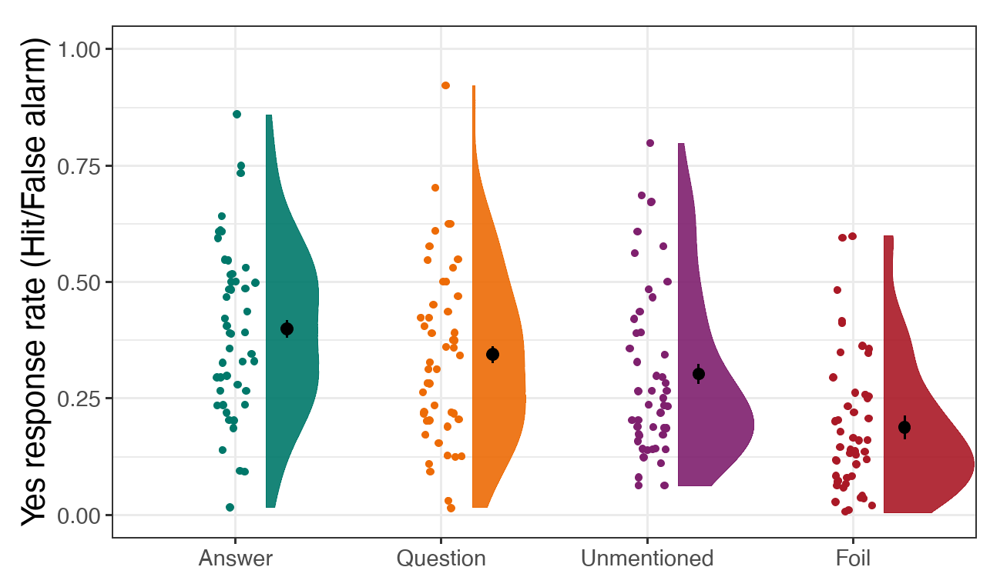
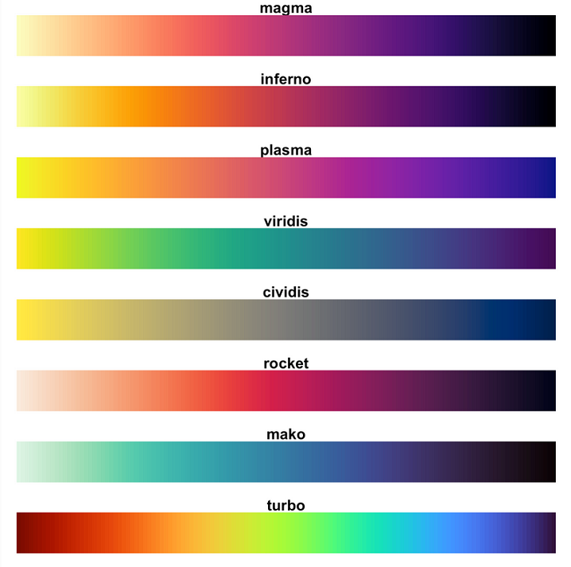

```{r setup, include=FALSE}
options(htmltools.dir.version = FALSE)
knitr::opts_chunk$set(
  #fig.width=9, fig.height=3.5, fig.retina=3,
  out.width = "100%",
  cache = FALSE,
  echo = TRUE,
  message = FALSE, 
  warning = FALSE,
  hiline = TRUE
)

library(tidyverse)
library(knitr)
library(viridisLite)
library(hexbin)
library(here)

interviews_plotting <- readr::read_csv(here("data", "interviews_plotting.csv"))
percent_items <- interviews_plotting %>% 
    group_by(village) %>%
    summarize(across(bicycle:no_listed_items, ~ sum(.x) / n() * 100)) %>% 
    pivot_longer(bicycle:no_listed_items, names_to = "items", values_to = "percent")
```

```{r xaringan-themer, include=FALSE, warning=FALSE}
# uses my fork of the xaringanthemer package to left-align code chunks by default
#devtools::install_github("bbartholdy/xaringanthemer") 
library(xaringanthemer)
style_duo(
  primary_color = "#1F4257",
  secondary_color = "#F97B64",
  text_bold_color = "#F97B64", 
  code_inline_color = "#29e6a4"
)
```

## Hi, I'm Eirini `r emo::ji("wave")`

.pull-left[

`r emo::ji("graduate")` PhD at MPI for Psycholinguistics
]

.pull-right[
`r emo::ji("briefcase")` Trainer on RDM at TU Delft
]

--




---
class: center, middle, inverse

## Why ggplot2?

---

.pull-left[

Because these are 'base' plots...
```{r base-plot, fig.retina=3}
boxplot(
  rooms ~ village, 
  interviews_plotting, 
  col = c("blue", "green", "red")
  )
```
]

--

.pull-right[

... and these are ggplots `r emo::ji("sunglasses")`
```{r ggplot, fig.retina=3}
interviews_plotting %>% ggplot(aes(x = village, y = rooms, fill = village)) +
    geom_violin() + scale_fill_viridis_d(alpha = 0.7) +
    theme_minimal() + labs(title = "Number of rooms by village", x = "", y = "") +
    theme(legend.position = "none", axis.text = element_text(size = 12))
```
]


---
class: center, middle

## ggplot2


[**ggplot2**](https://ggplot2.tidyverse.org/) is a package (included in **tidyverse**) for creating highly customisable plots that are built
step-by-step by adding layers.

The separation of a plot into layers allows a high degree of flexibility with
minimal effort.

---
class: center, middle

```r
<DATA> %>%
    ggplot(aes(<MAPPINGS>)) +
    <GEOM_FUNCTION>() +
    <CUSTOMISATION>
```
<a href="https://github.com/allisonhorst/stats-illustrations">

</a>

More artwork by [Allison Horst](https://github.com/allisonhorst/stats-illustrations)

---

class: center, middle, inverse

## Data visualisation crash-course


---

## Aesthetics

> Whenever we visualise data, we take data values and convert them in a systematic and logical way into the visual elements that make up the final graphic. [...] All data visualisations map data values into quantifiable features of the resulting graphic. We refer to these features as **aesthetics**.

.pull-right[
from Claus Wilke's [*Fundamentals of Data Visualization*](https://clauswilke.com/dataviz)
]

--

**Commonly used aesthetics are:**

- position (*x* and *y* coordinates),
- colour
- size
- shape
- line type

---
class: middle

## Find the green dot `r emo::ji("baby")`


```{r create-data, echo = FALSE}
plot1 <- data.frame(x = rnorm(100, 10, 1),
                    y = rnorm(100, 10, 1),
                    z = c(rep("a", 99), "b"))

plot2 <- data.frame(x = rnorm(100, 10, 1),
                    y = rnorm(100, 10, 1),
                    z = c(rep("b", 99), "a"))

plot3 <- data.frame(x = rnorm(100, 10, 1),
                    y = rnorm(100, 10, 1),
                    z = c(rep("a", 33), rep("b", 66), rep("a", 1)),
                    aa = c(rep("a", 66), rep("b", 34)))


```


```{r blue-dot1, echo = FALSE, fig.width=9, fig.height=5, fig.retina=3}
plot1 %>%
  ggplot(aes(x = x, y = y, colour = z)) +
  geom_point(size = 2.5) +
  scale_colour_manual(values=c("tomato", "#7aeb7a")) +
  labs(x = "", y = "", title = "Colour only, N = 100") +
  theme(legend.position = "none",
        plot.title = element_text(size=22),
        axis.text = element_blank(),
        axis.ticks = element_blank())

```

from Kieran Healy's [*Data Visualization: A practical introduction*](https://socviz.co/)

---
class: middle

## Find the green dot `r emo::ji("graduate")`


```{r blue-dot2, echo = FALSE, fig.width=9, fig.height=5, fig.retina=3}
plot2 %>%
  ggplot(aes(x = x, y = y, shape = z)) +
  geom_point(colour = "#7aeb7a", size = 2.5) +
  labs(x = "", y = "", title = "Shape only, N = 100") +
  theme(legend.position = "none",
        plot.title = element_text(size=22),
        axis.text = element_blank(),
        axis.ticks = element_blank())
```

from Kieran Healy's [*Data Visualization: A practical introduction*](https://socviz.co/)

---
class: middle

## Find the green dot `r emo::ji("alien")`

```{r blue-dot3, echo = FALSE, fig.width=9, fig.height=5, fig.retina=3}
plot3 %>%
  ggplot(aes(x = x, y = y, shape = z, colour = aa)) +
  geom_point(size = 2.5) +
  scale_colour_manual(values=c("tomato", "#7aeb7a")) +
  labs(x = "", y = "", title = "Colour and Shape, N = 100") +
  theme(plot.title = element_text(size=22),
        legend.position = "none",
        axis.text = element_blank(),
        axis.ticks = element_blank())
```

from Kieran Healy's [*Data Visualization: A practical introduction*](https://socviz.co/)


---

## Colour considerations

In the previous game, people with the most common type of colour-blindness would have struggled to perceive the colour distinction!


---

## Viridis palettes


.pull-left[

Are relatively colourblind-friendly...

```{r viridis-palettes, echo = FALSE, out.height="50%"}

```
]

--

.pull-right[

... and they're pretty `r emo::ji("smiling cat face with heart-eyes")`

```{r viridis-plot, echo = FALSE}
dat <- data.frame(x = rnorm(10000), y = rnorm(10000))

ggplot(dat, aes(x = x, y = y)) +
  geom_hex() + coord_fixed() +
  scale_fill_gradientn(colours = viridis(256, option = "D")) +
  labs(x = "", y = "")
```
]

from the [`viridisLite` site](https://sjmgarnier.github.io/viridisLite/reference/viridis.html) by Simon Garnier

---

class: center, middle, inverse

## Data visualisation exercises

---
class: center, middle

## Exercise 1

`r emo::ji("clock")` **10 mins**

Create a scatter plot of `rooms` by `village` with the `respondant_wall_type`
showing in different colours. 

Does this seem like a good way to display the relationship between these variables?

What other kinds of plots might you use to show this type of data?

`r countdown::countdown(minutes = 10, color_running_background  = "lightgreen", color_running_text = "black", color_finished_background = "red", color_finished_text =  "grey30")`

---
class: center, middle, inverse

## Exercise 1: Solution

```{r exercise-1-sol, fig.width=9, fig.height=3.5, fig.retina=3}
interviews_plotting %>%
    ggplot(aes(x = village, y = rooms)) +
    geom_jitter(aes(color = respondent_wall_type),
		    alpha = 0.5, width = 0.2, height = 0.2)
```

It is difficult to distinguish between villages and see patterns, right?

Suggestions to improve this?

---
class: center, middle

## Exercise 2

`r emo::ji("clock")` **5 mins**

Boxplots are useful summaries, but hide the shape of the distribution. For example,
if the distribution is bimodal, we would not see it in a boxplot.

Replace the box plot with a violin plot  
see `geom_violin()`

`r countdown::countdown(minutes = 5, color_running_background  = "lightgreen", color_running_text = "black", color_finished_background = "red", color_finished_text =  "grey30")`

---
class: center, middle, inverse

## Exercise 2: Solution

```{r exercise-2-sol, fig.width=9, fig.height=3.5, fig.retina=3}
interviews_plotting %>%
  ggplot(aes(x = respondent_wall_type, y = rooms)) +
  geom_violin(alpha = 0) +
  geom_jitter(alpha = 0.5, color = "tomato")
```

---
class: center, middle

## Exercise 3

`r emo::ji("clock")` **10 mins**

Create a bar plot showing the proportion of respondents in each village who are 
or are not part of an irrigation association (`memb_assoc`). 

Include only respondents who answered that question in the calculations and plot.

Which village had the lowest proportion of respondents in an irrigation association?

`r countdown::countdown(minutes = 10, color_running_background  = "lightgreen", color_running_text = "black", color_finished_background = "red", color_finished_text =  "grey30")`

--

### Hint

```{r exercise-3-hint}
percent_memb_assoc <- interviews_plotting %>%
  filter(!is.na(memb_assoc)) %>%
  count(village, memb_assoc) %>%
  group_by(village) %>%
  mutate(percent = (n / sum(n)) * 100) %>%
  ungroup()
```

---
class: center, middle, inverse

## Exercise 3: Solution

```{r exercise-3-sol, fig.width=7, fig.height=2.5, fig.retina=3}
percent_memb_assoc <- interviews_plotting %>%
  filter(!is.na(memb_assoc)) %>%
  count(village, memb_assoc) %>%
  group_by(village) %>%
  mutate(percent = (n / sum(n)) * 100) %>%
  ungroup()

percent_memb_assoc %>%
   ggplot(aes(x = village, y = percent, fill = memb_assoc)) +
    geom_bar(stat = "identity", position = "dodge")
```

---
class: center, middle

## Exercise 4

`r emo::ji("clock")` **5 mins**

Experiment with at least two different themes. Build the previous plot using each
of those themes. 

Which do you like best?

`r countdown::countdown(minutes = 5, color_running_background  = "lightgreen", color_running_text = "black", color_finished_background = "red", color_finished_text =  "grey30")`

--

### Hint

.pull-left[
`theme_minimal`  
`theme_void`  
`theme_classic`  
]
.pull-right[
`theme_dark`  
`theme_grey`  
`theme_light`
]

---
class: center, middle, inverse

## Exercise 4: My preference

```{r exercise-4-sol, eval = FALSE}
percent_items %>%
    ggplot(aes(x = village, y = percent)) +
    geom_bar(stat = "identity", position = "dodge") +
    facet_wrap(~ items) +
    theme_minimal() + #<<
    theme(panel.grid = element_blank())
```

---

## This is just the beginning!

`ggplot2` and compatible packages give you a huge amount of flexibility to create **exactly** the graph you want!

You can explore packages that give you access to:
- add beautiful palettes (`ghibli`, `wesanderson`),
- new themes (`hrbrthemes`)
- additional fonts (`extrafont`)
- animated graphs (`gganimate`)
- and so much more!
